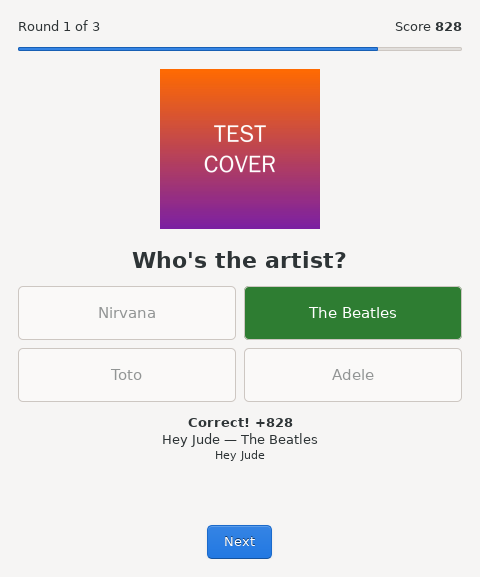
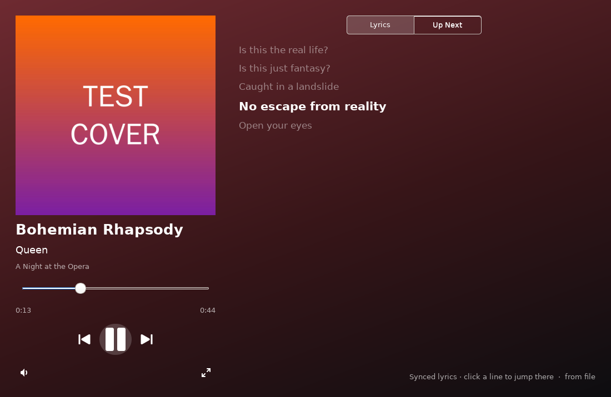
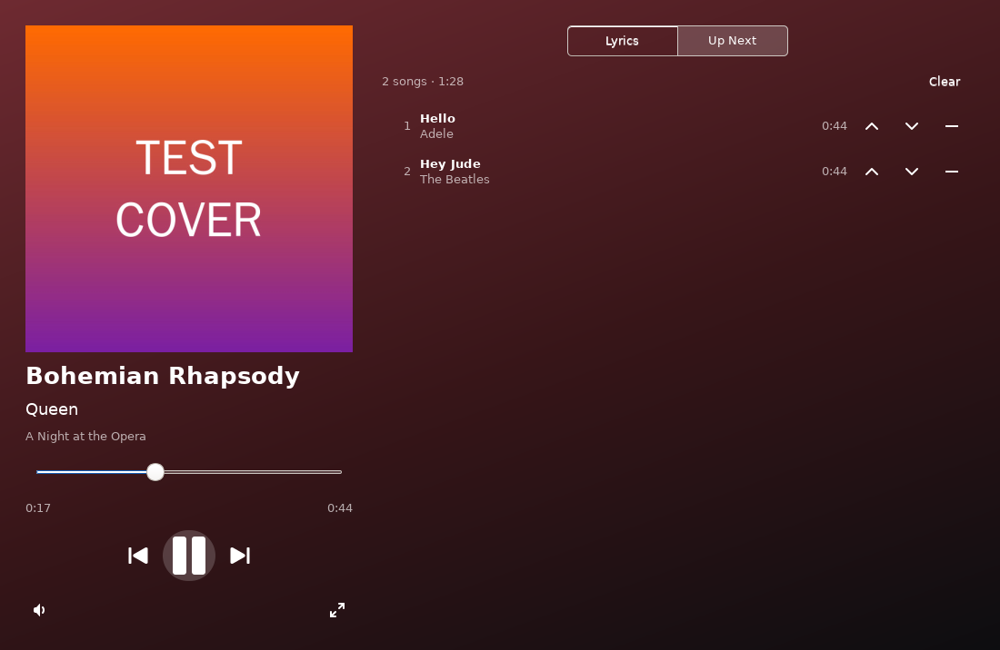

# Rhythmbox plugins

Two plugins for the [Rhythmbox](https://wiki.gnome.org/Apps/Rhythmbox) music
player (version 3.x, Python 3).

## Name That Tune

A music quiz built from your own library. Each round plays 15 seconds from
somewhere in the middle of a random song. You pick the right title or artist
from four choices.

- Faster answers score more (1000 down to 100 points), and a streak adds a bonus.
- **Replay snippet** rewinds the clip, but the clock keeps running.
- After you answer, it shows the song, album and cover art.
- To keep the answer hidden, it minimizes the main Rhythmbox window and pauses
  the Notification plugin's song popups during the game.
- When the game ends, whatever you were listening to resumes where it left off.

Open it from **Tools → Name That Tune…** (in the ☰ menu). You need at least 4
songs with different titles or artists.



## Now Playing Display

A large now-playing window, opened from **View → Now Playing Display**.

- **Album art**, with a background tinted to match the cover.
- Title, artist, album and year, a seek bar, play/pause, previous/next and volume.
- **Lyrics**. Synced lyrics highlight and scroll along with the song, and you can
  click any line to jump to that point. Lyrics are found in this order:
  1. A `.lrc` file next to the song (`My Song.mp3` → `My Song.lrc`)
  2. The plugin's cache in `~/.cache/rhythmbox/now-playing-lyrics/`
  3. [LRCLIB](https://lrclib.net), a free lyrics service with no account needed
- **Up Next** shows the play queue with its total length. You can move songs up
  and down, remove them, clear the queue, or double-click a song to play it now.
  To add songs, right-click them in Rhythmbox and choose **Add to Play Queue**.
- **F11** toggles full screen, and **Space** plays or pauses.




## Install

```sh
cd rhythmbox-plugins
./install.sh
```

This copies both plugins to `~/.local/share/rhythmbox/plugins/`. Restart
Rhythmbox, open **Preferences → Plugins**, and turn on **Name That Tune** and
**Now Playing Display**.

To update, run `./install.sh` again and restart Rhythmbox. To uninstall, run
`./install.sh --remove`.

If a plugin doesn't appear, start Rhythmbox from a terminal with `rhythmbox -D`
to see Python errors.

### Flatpak Rhythmbox

The Flatpak build looks for user plugins in its own data folder instead:

```sh
XDG_DATA_HOME=~/.var/app/org.gnome.Rhythmbox3/data ./install.sh
```

## Tests

The game rules and lyrics parsing don't depend on GTK and have unit tests:

```sh
python3 -m unittest discover -s rhythmbox-plugins/tests
```
